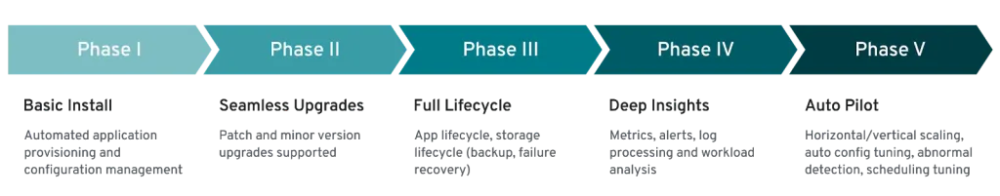
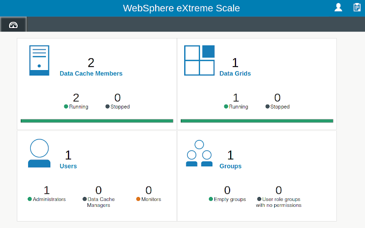
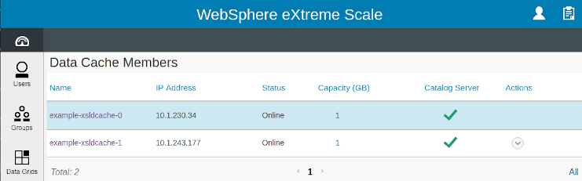
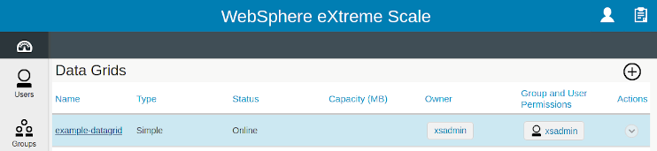

# xsld-operator
The XSLD Operator is a Kubernetes operator for managing [IBM eXtreme Scale Liberty Deployment (XSLD)](https://www.ibm.com/support/knowledgecenter/en/SSTVLU_8.6.1/com.ibm.websphere.extremescale.doc/cxsgetstartxsld.html) based on the [official IBM XSLD container image](https://hub.docker.com/r/ibmcom/xsld/).

> **Note:** The project is an outcome of a customer proof-of-concept and it isn't yet ready for production use. At this stage, the binary will only be provided upon individual requests.

The XSLD Operator, written in Go, is developed using the open-source [Operator-SDK](https://github.com/operator-framework/operator-sdk) which is part of the [Operator Framework](https://github.com/operator-framework) toolkit maintained by RedHat. In terms of the Operator Framework maturity model, the operator roughly covers the following phases at various levels of completeness:
<p align="center">

</p>

- [x] **Basic install**  
The operator provides an easy-to-use way to install and run an XSLD cache in Kubernetes. Using custom CRDs, aligned with the inner logical structure of XSLD, users can declaratively create multi-member XSLD cache deployments and define custom Data Grid configurations without resort to manual configuration using the web UI. The operator also automatically provisions and manages per-member storage volumes. Out-of-band adjustments to the XSLD container startup are devised in order to cater for the specifics of Kubernetes networking (the XSLD container image is not modified).

- [x] **Seamless Upgrades**  
The XSLD operator is built around a standard Kubernetes StatefulSet replication controller and it's image rolling update function is propagated into the cache controller.

- [x] **Full lifecycle**  
Aside of automatic persistent storage provisioning and de-provisioning, no persistent data backup/recovery measures are implemented. HA mode of XSLD cache is being explored.

- [ ] **Deep Insights**  
This area is yet to be explored and addressed, possibly exposing and integrating the built-in XSLD performance metrics and logs.

- [x] **Auto Pilot**  
The core of the XSLD operator functionality lies in the automated XSLD cache deployment, cache group establishment, maintenance, dynamic scaling and data partition configuration. In particular, XSLD cache group rescaling involves highly coordinated and well-timed triggering of join/disjoin tasks executed on the cache members using the XSLD REST APIs.

### About eXtreme Scale Liberty Deployment

The WebSphere® eXtreme Scale Liberty Deployment provides Liberty caching servers, caching operation tools, an administration console, and the out-of-the-box REST administration services based on the latest industry standards and specifications. XSLD is built based on the core eXtreme Scale technology.

[WebSphere eXtreme Scale Liberty Deployment (XSLD)](https://www.ibm.com/support/knowledgecenter/en/SSTVLU_8.6.1/com.ibm.websphere.extremescale.doc/cxsgetstartxsld.html) provides more features and extensions such as cloud enablement, speed of deployment, ease of administration, and ease of integration, and customizable scripts and REST APIs. XSLD runs within the IBM® Liberty runtime environment. The main components are:

- WebSphere eXtreme Scale caching service and servers
- Administrative REST services
- Operational REST services
- Multi-tenancy processes

## How the XSLD Operator works
The operator design follows closely the concepts and best practises provided by the Operator SDK project. *Custom Resource Definitions (CRD)* are defined for setting up the multi-pod XSLD cache group and configuration of the data grid partitions inside the cache group. Controllers around each of the CRD implement the level-based reconciliation logic to maintain the desired state.

The operator leverages the Kubernetes *StatefulSet* replication controller for ordered pod deployment with managed *PersistentVolumeClaims* backed by *PersistentVolumes*, currently using NFS backend. Each PVC holds runtime data and configuration associated with the respective XSLD cache instance. The PVCs lifetime is aligned with the declared state of the StatfulSet, which ensures the XSLD cache group is recovered even in case of pod/container restarts. Unlike default StatefulSet function, the PVC are deleted and the data volumes are reclaimed back by the operator as soon as pods are removed from the managed set as a result of a scale-down condition.

The XSLD cache configuration and control tasks and status retrieval is hadled via the [XSLD Admin and Operational REST API](https://www.ibm.com/support/knowledgecenter/en/SSTVLU_8.6.1/com.ibm.websphere.extremescale.doc/cxsaccessgridxsldREST.html). [Swagger Codegen](https://github.com/swagger-api/swagger-codegen) generator is used to generate the corresponding Go client module from the exported OpenAPI specification.

## Custom Resource Definitions

### `XsldCache`
**`XsldCache`** is the primary resource which defines the XSLD cache group managed by a StatefulSet replication controller.

The main **`XsldCache`** CRD defines a group of interconnected XSLD members. When an `XsldCache` resource is created, the controller creates a corresponding StatefultSet, initializes the cache members in the ordinal sequence and allocates new data volumes as PVCs. New members are automatically joined to the cache group by execution of the XSLD Join Task as soon as the container processes are initialized. State logic is in place to trigger the join/disjoin tasks in the correct phases of the pod startup/termination, taking care of request retries and parallel task conflicts. The controller maintains an independent watch loop (via a goroutine) for the runtime cache status.

The `XsldCache` resource controller additionally creates a Headless Service matching the StatefulSet which provides DNS name resolution for the pods (the XSLD requires own FQDN hostname resolution during startup, which has implications on the Readiness probe checks).

When the XSLD cache group is scheduled for a scale-down, the leaving members correctly disjoin the group (via the API Disjoin Task) prior to the pod termination. After the pods terminate, the controller deletes the associated PVCs (which isn't the default StatefulSet behavior)

```yaml
apiVersion: xsld.ibm.com/v1alpha1
kind: XsldCache
metadata:
  name: example-xsldcache
spec:
  # License acceptance (immutable)
  license: accept
  # Size defines the desired number of members joined in the
  # cache group. Corresponds to the number of the stateful set replicas
  size: 1
  # Image is the repository and tag of the XSLD container image
  # Default is `ibmcom/xsld:latest`
  image: ibmcom/xsld:8613
  # AdminPwd is the xsadmin user password (immutable). 
  adminPwd: Password123!
  # SecretKey is the secret key for the cache group (immutable).
  secretKey: Password123!
  # Capacity is memory size allocated to a member in GB (immutable).
  # Default capacity is 1GB
  capacity: 1 
  # Catalogs is the number of catalog servers in the cache
  # group. Default is 3 catalog servers.
  catalogs: 3
  # EntrypointConfigMap is the name of a configmap with custom
  # entrypoint.sh which overides the default entrypoint
  entrypointConfigMap: ip-update-entrypoint
  # Group is the name of the cache group (immutable). Default
  # name is 'cg1'
  group: cg1
 ```

Status fields
```
NAME                MEMBERS   ONLINE   TASKS   GRIDS   AGE
example-xsldcache   2         2        1       1       2d
```

### `DataGrid`

**`DataGrid`** defines the data grids that are created inside the matching `XsldCache` instance in the given namespace. Multiple data grids, i.e. multiple `DataGrid` objects, can be created in a cache.

```yaml
apiVersion: xsld.ibm.com/v1alpha1
kind: DataGrid
metadata:
  name: example-datagrid
spec:
  # Description of the grid
  decription:
  # Grid capacity in MB default value 0 means unlimited
  gridCapacity:
  # Type of grid: Simple, Session, DynaCache, Custom
  gridType: Simple
  # Name of the group which owns the grid this field is overrideiiiikkjjjjjjjjjjjkkkkjkkkkkkkkkjjjjjjjjjjjjjjjjjjjjkhhhhhhhhhhhn
  #  by the name defined in the referenced XsldCache object
  groupName:
  # Lock time out for the backing maps in seconds default is
  lockTimeout: 15
  # Number of asynchronous replicas default is 1 replica
  numAsyncReplicas: 1
  # Number of partitions the number must be a prime number. Default is 3
  numPartition: 3
  # Number of synchronous replicas
  numSyncReplicas:
  # Name of tde grid owner default is xsadmin
  ownerName: xsadmin
  # Grid template name
  templateName: Simple
  # How long each map entry is present in seconds
  timeToLive:
  # Transaction timeout in seconds default is 30 seconds
  transactionTimeout: 30
  # Turn on authentication
  useAuthentication: false
  # Turn on authorization
  useAuthorization: false
  # Use LRU evictor for grid capacity
  useCapLRUEvictor:
```

`DataGrid` Status returns the online status of the data grid.

## Usage

The following commands assume the operator is already running either in the cluster as a deployment or locally using the `operator-sdk up local` mode. The operator deployment details are not covered in this overview.

#### Create the xsld-operator CRDs in Kubernetes
```sh
$ kubectl create -f deploy/crds/xsld.ibm.com_xsldcaches_crd.yaml
$ kubectl create -f deploy/crds/xsld.ibm.com_datagrids_crd.yaml
$ kubectl api-resources | grep xsld

NAME                              SHORTNAMES   APIGROUP                                      NAMESPACED   KIND
datagrids                                      xsld.ibm.com                                  true         DataGrid
xsldcaches                                     xsld.ibm.com                                  true         XsldCache
```

#### Create new `XsldCache` resource in the current context namespace
```sh
apiVersion: xsld.ibm.com/v1alpha1
kind: XsldCache
metadata:
  name: example-xsldcache
spec:
  license: accept
  size: 1
  adminPwd: Password123!
  secretKey: Password123!
  image: ibmcom/xsld:8613
  entrypointConfigMap: ip-update-entrypoint
```

It takes several minutes for the XSLD processes to initialize. The operator watches the cache runtime and updates its status when the member is up and running.
```sh
$ kubectl create -f deploy/crds/xsld.ibm.com_v1alpha1_xsldcache_cr.yaml
$ kubectl get xsldcache
NAME                                       MEMBERS   ONLINE   TASKS   GRIDS   AGE 
xsldcache.xsld.ibm.com/example-xsldcache   1         1                        1d
```

Check the actual Kubernetes objects created and managed by the operator: `StatefultSet`, headless `Service`, `PVCs`, `Pods`
```sh
$ kubectl get all -l app=example-xsldcache
NAME                      READY   STATUS    RESTARTS   AGE
pod/example-xsldcache-0   1/1     Running   0          165m

NAME                        TYPE        CLUSTER-IP   EXTERNAL-IP   PORT(S)    AGE
service/example-xsldcache   ClusterIP   None         <none>        9443/TCP   165m

NAME                                 READY   AGE
statefulset.apps/example-xsldcache   2/2     165m

$ kubectl get pvc
NAME                      STATUS   VOLUME                    CAPACITY   ACCESS MODES   STORAGECLASS   AGE
vol-example-xsldcache-0   Bound    example-xsldcache-vol-1   100Mi      RWO                           166m
```

#### Scale up cache to form a group of 2 members.
The operator first scales the underlying `StatefulSet` and allocates a new `PVC`. After the new container is initialized the operator runs an API Join Task which joins the new member to the group. The group enrollment process is captured in the `XsldCache` resource Status. Note, the XSLD member startup and join tasks take up to 7 minutes!
```sh
$ kubectl edit xsldcache example-xsldcache # Set "scale" field from 1 to 2
$ watch kubectl get xsldcache,pod,pvc
```


The cache group is formed and both instances are online.

```
NAME                MEMBERS   ONLINE   TASKS   GRIDS   AGE
example-xsldcache   2         2                        1d
```

#### Create new `DataGrid` resource
```yaml
apiVersion: xsld.ibm.com/v1alpha1
kind: DataGrid
metadata:
  name: example-datagrid
spec:
  # Description of the grid
  # description:
  # Name of the grid owner
  # ownerName: xsadmin
  # Turn on authentication
  # useAuthentication: false
  # Turn on authorization
  # useAuthorization: false
  # Grid capacity in MB
  # gridCapacity: 
  # Use LRU evictor for grid capacity
  # useCapLRUEvictor:
  # Transaction timeout in seconds
  # transactionTimeout:
  # Number of partitions
  numPartition: 3
  # Number of synchronous replicas
  # numSyncReplicas:
  # Number of asynchronous replicas
  # numAsyncReplicas:
  # How long each map entry is present in seconds
  # timeToLive:
  # Lock time out for the backing maps in seconds
  # lockTimeout:
  # Type of grid
  # gridType: Simple
  # Grid template name 
  templateName: Simple
  # Name of the group which owns the grid
  # groupName:
```

```bash
$ kubectl create -f deploy/crds/xsld.ibm.com_v1alpha1_datagrid_cr.yaml
$ kubectl get datagrid
NAME               TYPE   CAPACITY   STATUS
example-datagrid
```

Watch the group being added to the cache
```sh
$ watch kubectl get xsldcache example-xsldcache
```


#### Cache scale-down
```sh
$ kubectl edit xsldcache example-xsldcache # set "size" field  back to 1
$ watch kubectl get xsldcache,pod,pvc
```


#### Verify the cache configuration in the XSLD WebUI
The cache configuration can be verified using the XSLD web UI accessed from the primary pod:

https://example-xsldcache-0.example-xsldcache.default.svc.cluster.local:9443/wxsui/

<div align="center">

<p></p>

<p></p>

</div>
